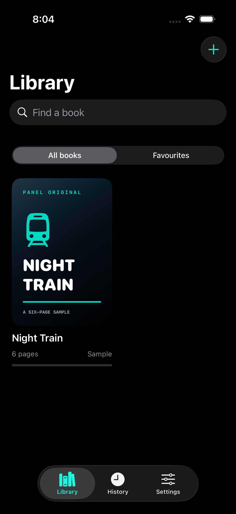
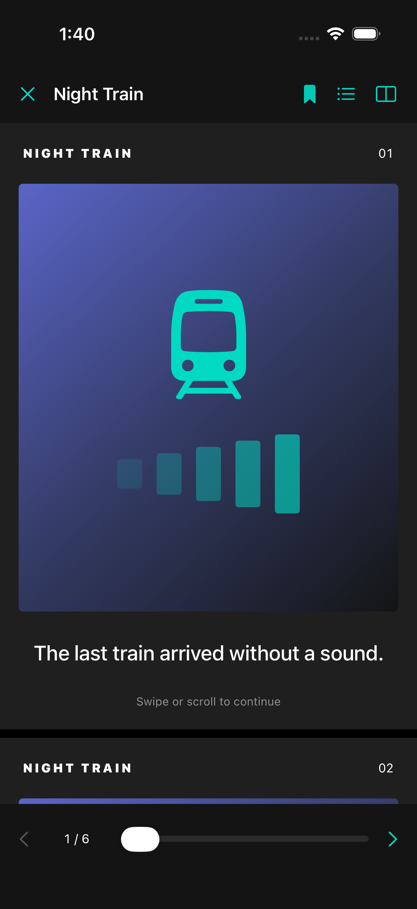

# Panel Reader for iOS

An independent SwiftUI reader starter for iPhone and iPad. Created for
Masukur Rahman on 9 October 2026. Requires iOS/iPadOS 17 or later.

**Start with [START_HERE.md](START_HERE.md).** Windows users can edit the files
and use the included GitHub Actions workflow to build on a cloud Mac.

[Public repository](https://github.com/masukur190929/panel-reader-ios) ·
[Cloud build results](https://github.com/masukur190929/panel-reader-ios/actions)

## Current status

The source is public. The new Sources browser is awaiting cloud validation.
The [previous cloud build and all seven tests](https://github.com/masukur190929/panel-reader-ios/actions/runs/37937634798)
passed on 9 October 2026 using Xcode 26.6 and an iPhone simulator. The expanded
suite also checks saved websites, web bookmarks, address validation and browser
navigation. Browser UI tests use clearly labelled, original local HTML fixtures;
they do not certify that a third-party site works or grants integration rights.
Screenshots and a test summary are exported as the `reader-ui-previews` Actions
artifact; download it from the linked run while its five-day retention lasts.

Real-device testing and signed distribution have not run. The app is not on
TestFlight or the App Store. Apple accounts and signing certificates are not
configured.

## Simulator preview

Actual UI-test screenshots from the latest validated build, on an iPhone 17 Pro simulator running iOS 26.5.
The sample artwork is original demonstration content.

| Library | Reader |
| --- | --- |
|  |  |

[Book details](docs/images/book-details.png) · [History](docs/images/history.png)
· [Right-to-left reader](docs/images/reader-rtl.png)
· [Machine-readable test summary](docs/validation/simulator-test-summary.json)

## Features implemented in the source

| Feature | Scope |
| --- | --- |
| Library | Original sample, PDF import and image-batch import |
| Organisation | Search, favourites, delete confirmation |
| Reading | Vertical/horizontal modes, right-to-left horizontal pages, previous/next buttons, bookmark jumps; PDFKit zoom; image centre zoom |
| State | Saved page, bookmarks and history on the device |
| iPad | Adaptive library grid and iPad orientations |
| Website browsing | ManhuaTop and ManhuaUs website shortcuts, editable/custom sources, private WebKit sessions, saved pages, resume links and sharing |
| Native online catalogue | Provider protocol only; native search, chapter lists and downloads are not implemented |

Images are sorted by natural filename order. Multiple PDFs create separate
books; several images create one book. Mixed PDF/image selections are rejected.
Imported files are copied into app storage, so the original may be removed
without losing the imported copy. File copying and validation run in a background task while import status is
shown. Covers are downsampled and cached off the main actor. The final library
update preserves favourites and progress changed during an import.
Metadata is saved atomically. A damaged index is preserved and made read-only
instead of being silently overwritten.

## Build on a Mac

Open `PanelReader.xcodeproj`, select the PanelReader scheme and run on an iPhone
simulator. No external Swift package or project-generator tool is required.
If you add source files, regenerate the project with:

```bash
python3 scripts/generate_project.py
```

For command-line tests:

```bash
PANEL_SIMULATOR_ID=$(python3 scripts/choose_simulator.py)
xcodebuild test -project PanelReader.xcodeproj -scheme PanelReader \
  -destination "platform=iOS Simulator,id=$PANEL_SIMULATOR_ID" \
  CODE_SIGNING_ALLOWED=NO
```

## Build from Windows

The `Build and test iOS` workflow uses a standard `macos-26` GitHub-hosted
runner. Such standard runners are free for public repositories. Test result
artifacts are retained for five days; artifact storage has separate allowances.
A private repository has different included-minute and billing limits.

The automatic workflow is unsigned and requires no Apple membership. It runs
only simulator tests. The **manual** `Upload to TestFlight` workflow needs an
Apple Developer account, distribution certificate, matching profile, API key
and app record. See [the Windows signing guide](docs/SIGNING_FROM_WINDOWS.md).
Uploading to TestFlight does not automatically publish an App Store listing.

## Code ownership and content

This starter is an independent implementation. No Kotatsu source code, parsers,
logos or manga were copied into it. The original code and geometric sample are
provided under the included MIT licence. Referenced GitHub Actions have their
own licences. The provisional app name has not been checked for availability.

Kotatsu's GPL-3.0 licence does not automatically apply to this independently
written project. If you later incorporate Kotatsu code or another GPL component,
reassess the resulting licence obligations and App Store distribution before
shipping. Changing the language of copied code does not remove its licence.

## Online browsing

Open **Sources** to visit `manhuatop.org` or `manhuaus.com`, the websites selected
from the user's Kotatsu screenshot. Add, edit or remove shortcuts with the plus
button and each card's context menu. Each website supplies its own search,
catalogue and reading controls. The app's search filters saved website links and
page bookmarks; it does not search all manga titles across websites.

Tap the browser's bookmark to save the current page, then reopen it from **Saved
pages**. Website shortcuts resume the last successfully loaded page on that
website. Cookies and sign-ins last for one browser session and are cleared when
it closes. Webpages make network requests and may display their own ads or
analytics; the app does not scrape, bundle or download their manga images.

These development shortcuts are not evidence of content rights or permission
for an App Store integration. Before submission, verify the service terms and
rights-holder permissions, and remove any bundled shortcut that cannot be
approved. See [the source research notes](docs/SOURCE_RESEARCH.md).

`PanelReader/Sources/MangaSource.swift` is a separate native catalogue contract.
A future permitted provider must implement search, chapters and page retrieval
before native catalogue browsing or chapter downloads can be offered.

## Next release work

See [the App Store release plan](docs/APP_STORE_RELEASE.md), including the
remaining product work and draft store/privacy information.

1. Review the simulator screenshots, then test on a real iPhone through TestFlight.
2. Finish reader usability: zoom/pan and progress under
   fast scrolling, orientation changes and large-file imports.
3. Select an authorised online provider and implement real browsing/chapters.
4. Add CBZ support and background downloads if needed; assess each dependency.
5. Confirm the name, bundle identifier, icon and content age rating.
6. Prepare screenshots, support contact, privacy policy, app privacy answers and
   source permissions. Review web traffic and third-party website data practices;
   the app has no developer-run analytics, ads or server.
7. Submit through App Store Connect; resolve Apple's review feedback.

## Primary references (checked 9 October 2026)

- [GitHub-hosted runner availability](https://docs.github.com/en/actions/reference/runners/github-hosted-runners)
- [GitHub Actions billing](https://docs.github.com/en/billing/concepts/product-billing/github-actions)
- [Apple membership options](https://developer.apple.com/support/compare-memberships/)
- [Apple TestFlight overview](https://developer.apple.com/help/app-store-connect/test-a-beta-version/testflight-overview/)
- [App Review Guidelines, including 5.2](https://developer.apple.com/app-store/review/guidelines/)
- [Certificate handling on GitHub Mac runners](https://docs.github.com/en/actions/how-tos/deploy/deploy-to-third-party-platforms/sign-xcode-applications)
- [Apple-Actions certificate importer](https://github.com/Apple-Actions/import-codesign-certs)
- [Apple-Actions TestFlight uploader](https://github.com/Apple-Actions/upload-testflight-build)
